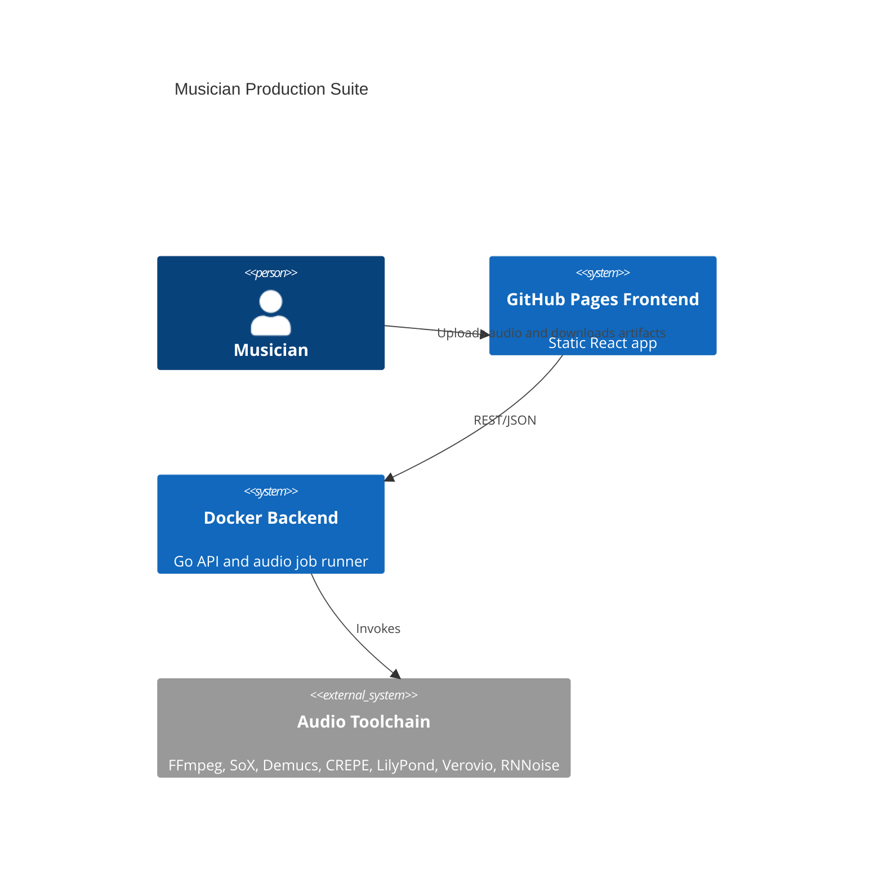
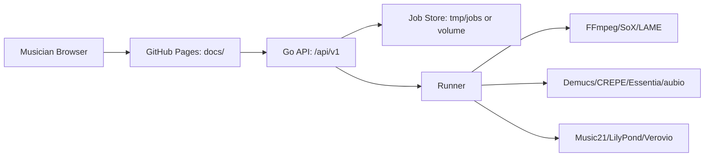

# Architecture

## Context

```mermaid
C4Context
    title Musician Production Suite
    Person(user, "Musician")
    System(frontend, "GitHub Pages Frontend", "Static React app")
    System(backend, "Docker Backend", "Go API and audio job runner")
    System_Ext(tools, "Audio Toolchain", "FFmpeg, SoX, Demucs, CREPE, LilyPond, Verovio, RNNoise")
    Rel(user, frontend, "Uploads audio and downloads artifacts")
    Rel(frontend, backend, "REST/JSON")
    Rel(backend, tools, "Invokes")
```

## Containers

```mermaid
flowchart LR
    U["Musician Browser"] --> P["GitHub Pages: docs/"]
    P --> A["Go API: /api/v1"]
    A --> J["Job Store: tmp/jobs or volume"]
    A --> R["Runner"]
    R --> F["FFmpeg/SoX/LAME"]
    R --> M["Demucs/CREPE/Essentia/aubio"]
    R --> S["Music21/LilyPond/Verovio"]
```

The Pages boundary is explicit: static assets live in `docs/`; audio processing
does not.

